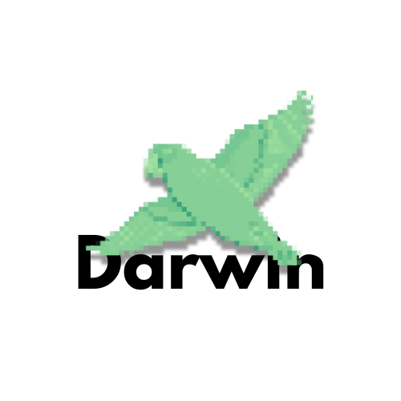

  

  
Darwin is a Bulgarian conversational dialog trainer using machine learning and natural language processing.

---

The project was initiated as an evolution of a previous project called [Edwin](https://bnr.bg/sofia/post/101707041/robotics-strategy-forum), which I started in 2020. Seeking a better solution for handling dialogues, I decided to develop Darwin in 2024.

## Natural Language Processing
The project initially used SpaCy with a Bulgarian language model created by [Ivaylo Sakelariev](https://github.com/sakelariev/bulgarian-spacy-models).

In the future, the project will incorporate [simplemma](https://github.com/adbar/simplemma).

## Installation
The current recommended way to install Darwin is from source.

The aim is to be a fully working Python package.

## License

This project is licensed under the Attribution-NonCommercial 4.0 International (CC BY-NC 4.0) license. You are free to share, copy, and adapt the material as long as you give appropriate credit, but it cannot be used for commercial purposes.
